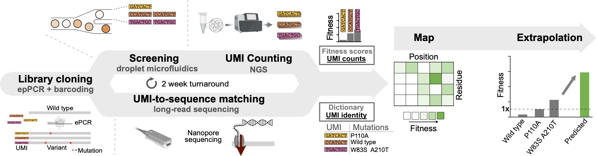

# Microdroplet screening rapidly profiles a biocatalyst to enable its AI-assisted engineering

[](https://www.biorxiv.org/content/10.1101/2024.04.08.588565)
[](https://openwetware.org/wiki/DropBase:Devices)
[](TODO)  
[](https://www.biorxiv.org/content/10.1101/2024.04.08.588565.full.pdf)
<a target="_blank" href="https://colab.research.google.com/drive/16rXKgbGXBBsHvS_2V84WbfKsJYf9lO4Q">
  
</a>

This repo contains the processing scripts, code and evaluation methods for the paper "[Microdroplet screening rapidly profiles a biocatalyst to enable its AI-assisted engineering](https://www.biorxiv.org/content/10.1101/2024.04.08.588565.full.pdf)".



## 📦 Installation

**Via github**:

```bash
git clone https://github.com/Hollfelder-Lab/lrDMS-IRED.git
cd lrDMS-IRED
pip install .
```

## 🚀 Usage

### Raw data processing using the UMIC-seq2 suite and DiMSum
The UMIC-seq2 pipeline is adapted from [Zurek et al 2020](https://www.nature.com/articles/s41467-020-19687-9) to allow for (i) the processing of larger datasets via use of mmseqs2 for clustering and (ii) incorporation of the UMI sequence in polished reads for use in long-read deep mutational scanning (lrDMS). Following the steps outlined in [`scripts`](scripts), raw Oxford Nanopore data can be used to generate a variant identifyer file 'VIF' that can be fed into the [DiMSum pipeline](https://github.com/lehner-lab/DiMSum). The provided scripts and outlined pipeline can also be used to analyse amplicon Oxford Nanopore data without downstream use of the file for lrDMS.   
If lrDMS is conducted, next-gerneration sequencing reads of the UMI region before and after screening are used to calculate fitness score and the VIF is used to link UMI and variant identity. The output of the processing pipeline is a `.csv` file containing the fitness scores for individual sequences. For convenience, the processed data is also provided in the [`data`](data) folder as `srired_active_data.csv`. This data can then be used for combinability and mutability analysis and machine learning.

### Generation of a mutational profile: Combinabiliy and mutability
ToDo: provide script that gives profile shown in Figure S17. 

### Combinability and Epistasis

The documentation for the analysis of epistasis is in the `epistasis` folder.

## 🧪 Data

Our data is available on Zenodo: [](TODO)

## 📜 License

## 📃 Citing this work

Please cite our paper if you use this code or data in your own work:

```bibtex
@article {
 Gantz2024,
 author = {Gantz, Maximilian and Mathis, Simon V. and Nintzel, Friederike E. H. and Zurek, Paul J. and Knaus, Tanja and Patel, Elie and Boros, Daniel and Weberling, Friedrich-Maximilian and Kenneth, Matthew R. A. and   Klein, Oskar J. and Medcalf, Elliot J. and Moss, Jacob and Herger, Michael and Kaminski, Tomasz S. and Mutti, Francesco G. and Lio, Pietro and Hollfelder, Florian},
 title = {Microdroplet screening rapidly profiles a biocatalyst to enable its AI-assisted engineering},
 elocation-id = {2024.04.08.588565},
 year = {2024},
 doi = {10.1101/2024.04.08.588565},
 publisher = {Cold Spring Harbor Laboratory},
 URL = {https://www.biorxiv.org/content/early/2024/04/08/2024.04.08.588565},
 eprint = {https://www.biorxiv.org/content/early/2024/04/08/2024.04.08.588565.full.pdf},
 journal = {bioRxiv}
}
```

## 👥 Authors

- [Hollfelder Lab](https://hollfelder.bioc.cam.ac.uk/), Department of Biochemistry, University of Cambridge, UK
- [Lio Lab](https://www.cst.cam.ac.uk/people/pl219), Department of Computer Science and Technology, University of Cambridge, UK

## 📧 Contact

For questions, please contact

- fh111(at)cam.ac.uk  
- mg985(at)cam.ac.uk
- simon.mathis(at)cl.cam.ac.uk
- fmw37(at)cam.ac.uk

## 🤝 Contributing

We welcome contributions to this repository. To set up the development environment, please follow the instructions below:

```bash
git clone https://github.com/Hollfelder-Lab/lrDMS-IRED.git
cd lrDMS-IRED
chmod +x contribute.sh
./contribute.sh
```
