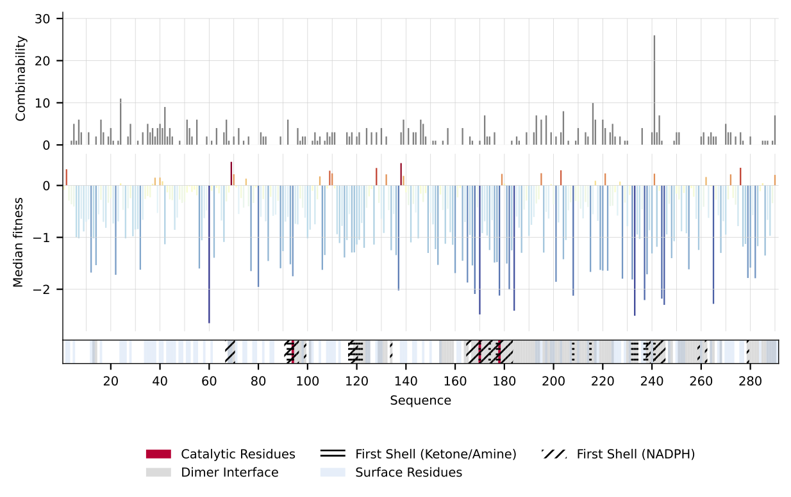

# Microdroplet screening rapidly profiles a biocatalyst to enable its AI-assisted engineering

[](https://www.biorxiv.org/content/10.1101/2024.04.08.588565)
[](https://openwetware.org/wiki/DropBase:Devices)
[](https://zenodo.org/records/11357236)
[](https://www.biorxiv.org/content/10.1101/2024.04.08.588565.full.pdf)

This repo contains the processing scripts, code and evaluation methods for the paper "[Microdroplet screening rapidly profiles a biocatalyst to enable its AI-assisted engineering](https://www.biorxiv.org/content/10.1101/2024.04.08.588565.full.pdf)".


## 📦 Installation

**Via github**:

To ensure you have a compatible environment to run the code in, we recommend using the [`environment.yaml`](environment.yaml) file to create a conda environment using `conda` or `mamba`. If you are curious, the detailed dependencies are listed in [`pyproject.toml`](pyproject.toml).

```bash
git clone https://github.com/Hollfelder-Lab/lrDMS-IRED.git
cd lrDMS-IRED

conda env create -f environment.yaml  # NOTE: This will auto-install all required dependencies and the `lrdms` package
conda activate lrdms
```

Alternatively, if you have an existing environment that you want to use, you can install `lrdms` and the required dependencies using pip.

```bash
git clone https://github.com/Hollfelder-Lab/lrDMS-IRED.git
cd lrDMS-IRED
pip install -e .
```

**Via pip**:

This will install `lrdms` in your environment's `site-packages`, and only include the main code & data,
not the notebooks. This means you'll be able to import the functions and data in `lrdms` for use in your 
own work. If you want to modify some of the code or try out the notebooks locally you should prefer one of the options above
(or use the colab links provided in the [`notebooks`](notebooks) folder.
```bash
pip install git+https://github.com/Hollfelder-Lab/lrDMS-IRED.git
```

## 🚀 Usage

### Raw data processing using the UMIC-seq2 suite and DiMSum

The UMIC-seq2 pipeline is adapted from [Zurek et al 2020](https://www.nature.com/articles/s41467-020-19687-9) to allow for (i) the processing of larger datasets via use of mmseqs2 for clustering and (ii) incorporation of the UMI sequence in polished reads for use in long-read deep mutational scanning (lrDMS). Following the steps outlined in [`scripts`](scripts), raw Oxford Nanopore data can be used to generate a variant identifyer file 'VIF' that can be fed into the [DiMSum pipeline](https://github.com/lehner-lab/DiMSum). The provided scripts and outlined pipeline can also be used to analyse amplicon Oxford Nanopore data without downstream use of the file for lrDMS.
If lrDMS is conducted, next-gerneration sequencing reads of the UMI region before and after screening are used to calculate fitness score and the VIF is used to link UMI and variant identity. The output of the processing pipeline is a `.csv` file containing the fitness scores for individual sequences. For convenience, the processed data is also provided in the [`data`](data) folder as `srired_active_data.csv`. This data can then be used for combinability and mutability analysis and machine learning.

### Generation of a mutational profile: Combinabiliy and mutability

A convenient summary profile of the combinability and mutability of the obtained data, which may be used to inform rational engineering campaigns, can be generated as demonstrated in [`notebooks/data_analysis.ipynb`](notebooks/data_analysis.ipynb).



### Combinability and Epistasis

The documentation for the analysis of epistasis is in the [`epistasis`](epistasis_combinability) folder.

### Analysis of single and double mutant models

For a detailed analysis of the single and double mutant models (replicatiosn of models in the paper, ablations, learning curves, feature importances, top predictions), please refer to the [`notebooks`](notebooks) folder, which contain analysis notebooks for each of the models.

## 🧪 Data

Our data is available in the [`data`](data) folder and on Zenodo: [](https://zenodo.org/records/11357236)

## 📜 License

This code is licensed under the MIT License - see the [LICENSE](LICENSE) file for details.

## 📃 Citing this work

Please cite our paper if you use this code or data in your own work:

```bibtex
@article {
 Gantz2024,
 author = {Gantz, Maximilian and Mathis, Simon V. and Nintzel, Friederike E. H. and Zurek, Paul J. and Knaus, Tanja and Patel, Elie and Boros, Daniel and Weberling, Friedrich-Maximilian and Kenneth, Matthew R. A. and   Klein, Oskar J. and Medcalf, Elliot J. and Moss, Jacob and Herger, Michael and Kaminski, Tomasz S. and Mutti, Francesco G. and Lio, Pietro and Hollfelder, Florian},
 title = {Microdroplet screening rapidly profiles a biocatalyst to enable its AI-assisted engineering},
 elocation-id = {2024.04.08.588565},
 year = {2024},
 doi = {10.1101/2024.04.08.588565},
 publisher = {Cold Spring Harbor Laboratory},
 URL = {https://www.biorxiv.org/content/early/2024/04/08/2024.04.08.588565},
 eprint = {https://www.biorxiv.org/content/early/2024/04/08/2024.04.08.588565.full.pdf},
 journal = {bioRxiv}
}
```

## 👥 Authors

- [Hollfelder Lab](https://hollfelder.bioc.cam.ac.uk/), Department of Biochemistry, University of Cambridge, UK
- [Lio Lab](https://www.cst.cam.ac.uk/people/pl219), Department of Computer Science and Technology, University of Cambridge, UK

## 📧 Contact

For questions, please contact

- fh111(at)cam.ac.uk  
- mg985(at)cam.ac.uk
- simon.mathis(at)cl.cam.ac.uk
- fmw37(at)cam.ac.uk

## 🤝 Contributing

We welcome contributions to this repository. To set up the development environment, please follow the instructions below:

```bash
git clone https://github.com/Hollfelder-Lab/lrDMS-IRED.git
cd lrDMS-IRED
chmod +x contribute.sh
./contribute.sh
```
