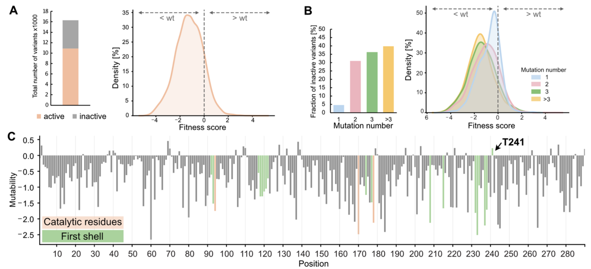

# Data

The main data from the lrDMS experiment is contained in [`srired_active_data.csv`](srired_active_data.csv). This file contains all ~11k sequences for which a fitness value could be determined. The remaining ~6k sequences for which no activity was measured are in [`srired_inactive_data.csv`](srired_inactive_data.csv).

The remaining data files are used for the analysis and modeling in the paper.