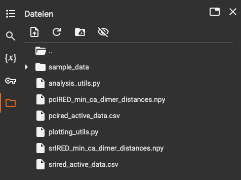

# Combinability and Epistasis

Scripts to preprocess deep mutational scanning (DMS) data. The data are analysed for combinability of mutations and the effect of epistasis.

If a residue distance matrix is available, structural epistasis graphs can be generated that visualise combinability hotspots and their centrality in the protein.

The used reference wildtype for the IRED that is also used in all scripts is:
```ruby
reference = "MRDTDVTVLGLGLMGQALAGAFLKDGHATTVWNRSEGKAGQLAEQGAVLASSARDAAEASPLVVVCVSDHAAVRAVLDPLGDVLAGRVLVNLTSGTSEQARATAEWAAERGITYLDGAIMAIPQVVGTADAFLLYSGPEAAYEAHEPTLRSLGAGTTYLGADHGLSSLYDVALLGIMWGTLNSFLHGAALLGTAKVEATTFAPFANRWIEAVTGFVSAYAGQVDQGAYPALDATIDTHVATVDHLIHESEAAGVNTELPRLVRTLADRALAGGQGGLGYAAMIEQFRSPS*"
```

## Data

The DMS data are stored in csv files. The IRED DMS data csv files are used in this repository is:

* `srired_active_data.csv`


## Installation

### Colab

The easiest way to run the scripts is via Google Colab. The Jupyter notebook `Epistasis_analysis.ipynb` can directly be opened on Colab by pressing the following Open in Colab button:

[](https://colab.research.google.com/github/fweberling/epistasis/blob/main/Epistasis_analysis.ipynb)

After having opened the notebook in Colab, the python scripts `analysis_utils.py` and `plotting_utils.py` need to be uploaded. These scripts contain the core functions for the analyses and plots to be carried out. Also, the csv file `srired_active_data.csv` containing the DMS data as well as the distance matrix npy file `min_dimer_distances.npy` must be uploaded as shown by the following screenshot:



### Terminal

The analyses can also be run via terminal.

#### Package requirements:
Following package requirements are necessary

* Python >= 3.9
* pandas >= 1.5.1
```commandline
pip install pandas
```
* numpy >= 1.23.4
```commandline
pip install numpy
```
* scipy >= 1.9.3
```commandline
pip install scipy
```
* scikit-learn >= 1.1.3
```commandline
pip install -U scikit-learn
```
* networkx >= 2.8.7
```commandline
pip install networkx
```
* matplotlib >= 3.6.0
```commandline
pip install -U pip
```
#### Running core analyses
The core analyses is given in `epistasis_analysis.py` and can be run via following command

```commandline
python3 epistasis_analysis.py
```

## License 

[MIT](https://choosealicense.com/licenses/mit/)
