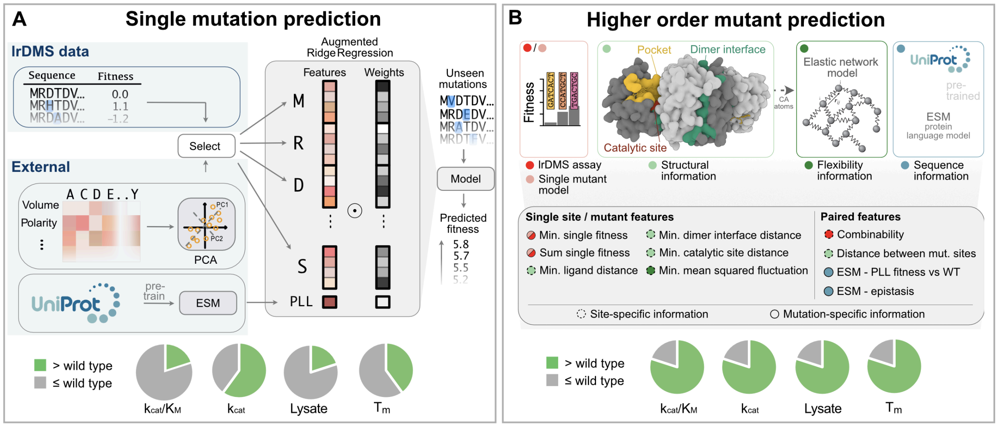

# Analysis notebooks

These analysis notebooks are for reproducing the results and plots in the main paper.

## Data analysis

The data analysis notebook contains a basic analysis of the data, including the distribution of fitness values, the distribution of the number of mutations, coverage of mutations at different positions, combinability computations.
It also contains an integrated profile plot of median single fitness values and combinability together with several structural annotations along the sequence which is useful for rational engineering campaigns.

## Machine learning modeling

### Single mutant model analysis

This notebook reproduces the single mutant model used for wet-lab experiments in the paper, including the top predictions. It also includes an ablation study of the language model features, the dataset, and learning curves.

### Double mutant model analysis

This notebook reproduces the double mutant model used for wet-lab experiments in the paper, including the top predictions. It also includes an ablation study of the language model features, the dataset, learning curves and analysis of feature importances.
