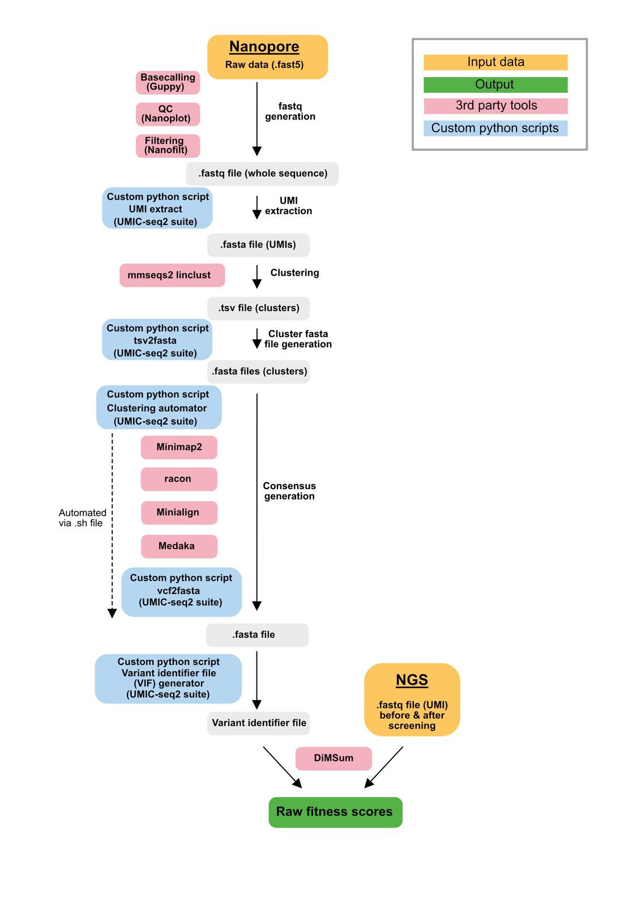

# UMIC-seq2 suite for analysis of Oxford Nanopore data

The `scripts` folder contains python scripts for the UMIC-seq2 analysis pipeline shown in the figure below.
You will need to use third party software (red boxes in the figure below) as well as the provided scripts here (blue boxes) to process the raw data. 


**Description of pipeline use**
Basecalling of Oxford Nanopore sequencing data was performed using guppy (ONT), quality control was performed using NanoPlot (1.40.2) and filtering using NanoFilt (2.8.0; length 1,250 --maxlength 1,400 --quality 8). umi_extract.py was used to extract the UMI sequences and the generated fasta file was clustered using the mmseqs2 suite (13.45111; min-seq-id 0.8, seq-id-mode 2, cov-mode 0 -c 0.8). A tsv file was exported and the python script tsv2fasta.py was used to generate .fasta files for individual clusters. The files were then processed in a custom pipeline (automated by generating a .sh file using clustering_automator.py) that iteratively runs  minimap2 (2.17) to align the sequences in every cluster, racon (1.4.20) to generate a draft sequence assembly, minialign (2.17) to align draft assembly and reference (with NNNN in variable regions of the UMI) and medaka (1.0.3; ONT) for generation of a consensus file. The vcf files generated by medaka were converted into .fasta files using clustering_automator.py. A variant identifier file for downstream data generation was generated using vif_generator.py. Fitness scores were calculated from the variant identifier file and the raw NGS foward reads using the DiMSum suite with the following parameters: retainIntermediateFiles T, cutadaptMinLength 20, vsearchMinQual 10, cutadaptErrorRate 0.6, numCores 8, paired F, indels all, maxSubstitutions 100, mixedSubstitutions T, barcodeErrorRate 0.1, fitnessMinInputCountAll 0.  

**Extraction of UMIs from basecalled Nanopore reads for clustering**
Use the following commands to run the script 'UMI_extract.py': 
``` 
-T Number of threads to execute in parallel. Defaults to CPU count.  
-v Gives Version
-i Provide basecalled reads in fastq format.  
-o Specify the name of the UMI output fasta file.  
--probe A short sequence (eg 50 bp) adjacent to the UMI in fasta format.  
--umi_loc Location of UMI in reference to the probe. Upstream (up) or downstream (down).  
--umi_len Length of the UMI to be extracted.  
--min_probe_score Minimal alignment score of probe for processing. Defaults to length of probe sequence.  
```

**Using the mmseqs2 output to generate a .fasta files for individual clusters**  
Use the following commands to run the script 'tsv2fasta.py': 
``` 
Positional argument: 'clusterfile' Provide MMseqs2 output file (as .tsv)  
--sizethreshs Low and high thresholds for cluster sizes. Defaults to 1 1000.  
--splitfile If a read file (fasta/fastq) is provided here, individual fasta files per cluster will be generated.  
--similarityfile If a read file (fasta/fastq) is provided here, <similaritysamplesize> clusters will be analysed for internal cluster similarity.  
--similaritysamplesize Sample size for within cluster similarity analysis. Defaults to 500. 
``` 

**An example for a python script generating an .sh file that can be used to automate consensus generation 'clustering_automator.py'**
To automate consensus generation via medaka for clusterfiles generated using the 'tsv2fasta.py' script the 'clustering_automator.py' script can be used to generate a .sh file that to iteratively call all tools neccesary for consensus generation (minimap2, racon, mini_align, medaka consensus, medaka variant and the vcf2fasta python script.

**'vcf2fasta.py' for generating a .fasta file from the vcf file generated by medaka variant**
Can be used in automation by using the 'clustering_automator.py' script

**Generating a variant identifyer file for DiMSum**
Use the following arguments to run 'VIF_generator.py':  
```
--probe_UMI_down 'A short sequence (eg 14 bp) beginning 4 bp downstream of the UMI in fasta format.'  
--probe_UMI_up 'A short sequence (eg 14 bp) ending 4 bp upstream of the UMI in fasta format.'  
--probe_frame_down 'A short sequence (eg 10 bp) flanking the frame (downstream) in fasta format.  
--probe_frame_up '(eg 10 bp) flanking the frame (upstream) in fasta format.  
--clusterfolder 'path to clusterfolder generated after using clustering_automator.py'  
```